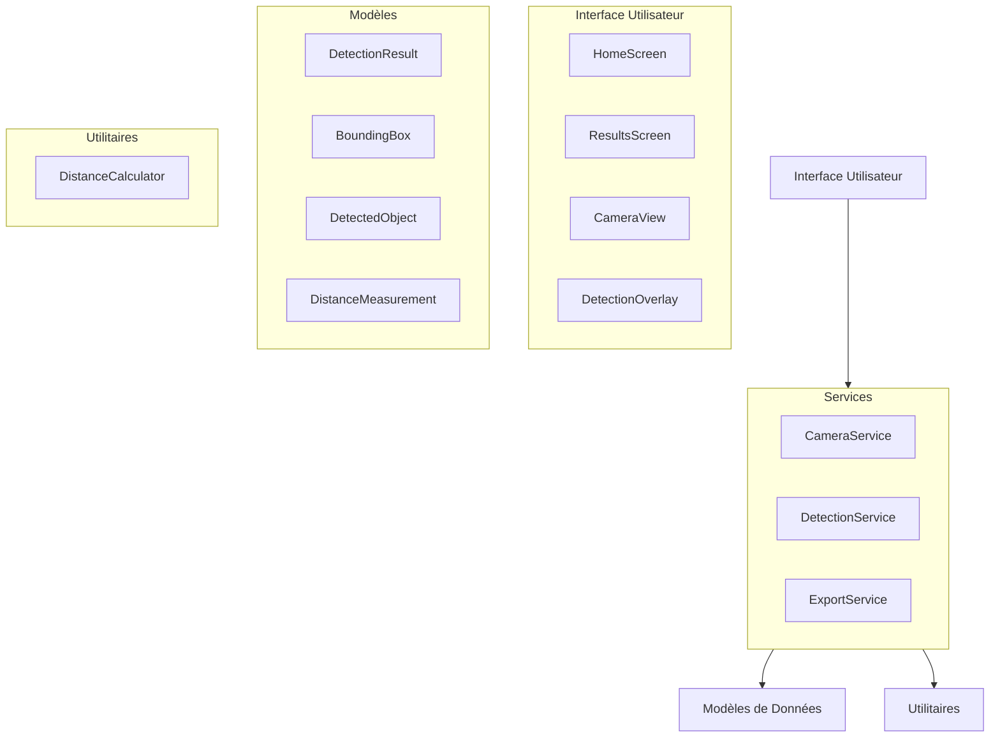
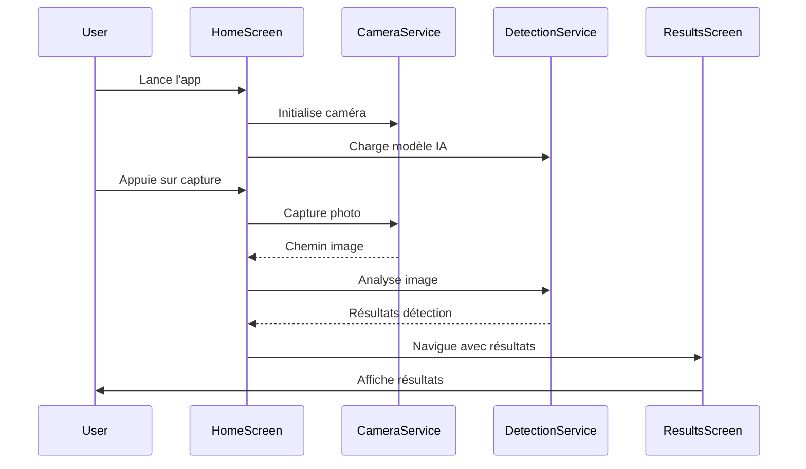
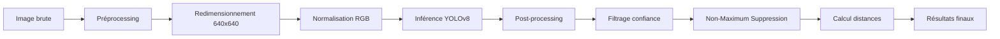

# Architecture de Golf Distance Detector

## 🏗️ Vue d'ensemble de l'architecture

L'application Golf Distance Detector suit une architecture modulaire basée sur le pattern **Service-Repository** avec une séparation claire des responsabilités.



## 📁 Structure des dossiers

```
lib/
├── main.dart                 # Point d'entrée de l'application
├── models/                   # Modèles de données
│   └── detection_result.dart # Classes pour les résultats de détection
├── services/                 # Services métier
│   ├── camera_service.dart   # Gestion de la caméra
│   ├── detection_service.dart # Intelligence artificielle
│   └── export_service.dart   # Export et partage
├── screens/                  # Écrans de l'application
│   ├── home_screen.dart      # Écran principal avec caméra
│   └── results_screen.dart   # Affichage des résultats
├── widgets/                  # Widgets réutilisables
│   ├── camera_view.dart      # Widget de caméra
│   └── detection_overlay.dart # Overlay de détection
└── utils/                    # Utilitaires
    └── distance_calculator.dart # Calculs de distances

assets/
├── models/                   # Modèles IA
│   ├── golf_yolov8.tflite  # Modèle TensorFlow Lite
│   └── labels.txt           # Labels des classes
├── images/                   # Images de l'app
├── icons/                    # Icônes personnalisés
└── fonts/                    # Polices personnalisées
```

## 🔄 Flux de données

### 1. Cycle de vie principal



### 2. Pipeline de détection



## 🧩 Composants principaux

### Models (`lib/models/`)

#### `DetectionResult`
Classe principale contenant tous les résultats d'une analyse :
- **Responsabilités** : Agrégation des données de détection
- **Relations** : Contient `DetectedObject` et `DistanceMeasurement`
- **Utilisation** : Passage de données entre services et UI

#### `DetectedObject`
Représente un objet détecté (balle ou drapeau) :
- **Propriétés** : Type, bounding box, confiance, label
- **Méthodes** : Calculs de position centrale
- **Utilisation** : Base pour les calculs de distance

#### `BoundingBox`
Définit une boîte englobante :
- **Propriétés** : Position (x,y) et dimensions (width, height)
- **Méthodes** : Propriétés calculées (center, right, bottom)
- **Utilisation** : Localisation précise des objets

#### `DistanceMeasurement`
Mesure de distance entre deux objets :
- **Propriétés** : Objets source/cible, distances en pixels/mètres
- **Utilisation** : Résultats de calculs de distance

### Services (`lib/services/`)

#### `CameraService`
Service de gestion de la caméra :
- **Pattern** : ChangeNotifier pour la réactivité
- **Responsabilités** :
  - Initialisation et configuration caméra
  - Gestion des permissions
  - Capture de photos
  - Contrôles (flash, changement caméra)
- **État** : Reactive avec `notifyListeners()`

#### `DetectionService`
Service d'intelligence artificielle :
- **Responsabilités** :
  - Chargement du modèle TensorFlow Lite
  - Préprocessing des images
  - Inférence avec YOLOv8
  - Post-processing (NMS, filtrage)
- **Performance** : Optimisé pour mobile
- **Format** : Support YOLOv8 au format .tflite

#### `ExportService`
Service d'export et partage :
- **Formats supportés** : 
  - Images (galerie)
  - Rapports texte
  - JSON structuré
  - CSV pour analyse
- **Intégrations** : 
  - Gallery Saver
  - Share Plus
  - File System

### Screens (`lib/screens/`)

#### `HomeScreen`
Écran principal avec caméra :
- **État** : StatefulWidget avec cycle de vie complexe
- **Responsabilités** :
  - Gestion des services
  - Interface caméra
  - Navigation vers résultats
- **Gestion d'état** : Provider pattern
- **Lifecycle** : WidgetsBindingObserver pour gestion app

#### `ResultsScreen`
Écran d'affichage des résultats :
- **Interface** : TabController avec 3 onglets
- **Fonctionnalités** :
  - Visualisation avec overlays
  - Statistiques détaillées
  - Options d'export
- **Interactivité** : Configuration d'affichage

### Widgets (`lib/widgets/`)

#### `CameraView`
Widget d'aperçu caméra :
- **Composition** : Stack avec preview et contrôles
- **Guides** : Règle des tiers et zone de focus
- **Contrôles** : Capture, flash, changement caméra
- **Responsive** : Adaptation à différentes tailles

#### `DetectionOverlay`
Widget de visualisation des détections :
- **Custom Painter** : Dessin direct sur Canvas
- **Éléments** :
  - Boîtes englobantes colorées
  - Lignes de distance
  - Labels et confiances
- **Performance** : Optimisé pour rendering temps réel

### Utils (`lib/utils/`)

#### `DistanceCalculator`
Utilitaire de calculs de distance :
- **Fonctions** :
  - Distance euclidienne
  - Calibration pixels ↔ mètres
  - Statistiques (min, max, moyenne, médiane)
- **Méthodes de calibration** :
  - Manuel
  - Via taille balle de golf
  - Distance connue

## 🎯 Patterns de conception

### 1. Service Pattern
Séparation claire entre logique métier (services) et interface utilisateur.

### 2. Observer Pattern
`CameraService` étend `ChangeNotifier` pour notifier l'UI des changements d'état.

### 3. Provider Pattern
Gestion d'état réactive avec le package `provider`.

### 4. Repository Pattern
Services comme abstraction pour l'accès aux données (caméra, IA, fichiers).

### 5. Strategy Pattern
`DistanceCalculator` avec différentes stratégies de calibration.

## 🔧 Configuration technique

### Dépendances principales

```yaml
# Interface et état
flutter: sdk
provider: ^6.1.1

# Caméra et permissions
camera: ^0.10.5+5
permission_handler: ^11.0.1

# Intelligence artificielle
tflite_flutter: ^0.10.4
tflite_flutter_helper: ^0.3.1

# Traitement d'images
image: ^4.1.3

# Stockage et partage
path_provider: ^2.1.1
gallery_saver: ^2.3.2
share_plus: ^7.2.1
```

### Configuration des permissions

#### Android (`android/app/src/main/AndroidManifest.xml`)
```xml
<uses-permission android:name="android.permission.CAMERA" />
<uses-permission android:name="android.permission.WRITE_EXTERNAL_STORAGE" />
<uses-permission android:name="android.permission.READ_EXTERNAL_STORAGE" />

<application android:requestLegacyExternalStorage="true">
```

#### iOS (`ios/Runner/Info.plist`)
```xml
<key>NSCameraUsageDescription</key>
<string>Cette app utilise la caméra pour détecter les balles de golf et drapeaux</string>
<key>NSPhotoLibraryUsageDescription</key>
<string>Cette app sauvegarde les photos analysées dans votre galerie</string>
```

## 🤖 Intelligence artificielle

### Modèle YOLOv8

#### Spécifications
- **Input** : 640x640x3 (RGB normalisé [0-1])
- **Output** : 8400 détections × 7 valeurs
- **Format** : [x_center, y_center, width, height, confidence, class1_prob, class2_prob]
- **Classes** : 0=golf_ball, 1=flag

#### Pipeline de traitement
1. **Préprocessing** :
   - Redimensionnement vers 640×640
   - Normalisation RGB [0-255] → [0-1]
   - Conversion en tensor Float32

2. **Inférence** :
   - Exécution du modèle TFLite
   - Récupération des prédictions brutes

3. **Post-processing** :
   - Filtrage par seuil de confiance (0.5)
   - Conversion coordonnées modèle → image
   - Non-Maximum Suppression (IoU > 0.5)
   - Création objets `DetectedObject`

### Optimisations performances
- **Quantization** : Modèle int8 pour réduire la taille
- **Threading** : Inférence sur thread séparé
- **Memory** : Réutilisation des tensors

## 📊 Gestion des données

### Format des résultats

#### JSON Export
```json
{
  "metadata": {
    "timestamp": "2024-01-15T14:30:00Z",
    "imageWidth": 1920,
    "imageHeight": 1080,
    "appVersion": "1.0.0"
  },
  "detectedObjects": [
    {
      "type": "golfBall",
      "confidence": 0.85,
      "boundingBox": {
        "x": 100, "y": 150,
        "width": 30, "height": 28,
        "centerX": 115, "centerY": 164
      }
    }
  ],
  "measurements": [
    {
      "golfBall": { "centerX": 115, "centerY": 164 },
      "flag": { "centerX": 800, "centerY": 400 },
      "distanceInPixels": 726.4,
      "distanceInMeters": 15.2
    }
  ]
}
```

#### CSV Export
```csv
Index,Type_Balle,Pos_Balle_X,Pos_Balle_Y,Conf_Balle,Type_Drapeau,Pos_Drapeau_X,Pos_Drapeau_Y,Conf_Drapeau,Distance_Pixels,Distance_Metres,Timestamp
1,Balle de golf,115.00,164.00,85.00,Drapeau,800.00,400.00,92.00,726.40,15.20,2024-01-15T14:30:00Z
```

## 🎨 Interface utilisateur

### Design System

#### Couleurs
- **Primaire** : Green (golf theme)
- **Balles** : Green (#4CAF50)
- **Drapeaux** : Red (#F44336)
- **Distances** : Yellow (#FFC107)
- **Arrière-plan** : Grey.shade50

#### Composants
- **Cards** : Elevation 4, BorderRadius 12
- **Buttons** : Material Design 3
- **Overlays** : Semi-transparent avec blur

### Responsive Design
- **Orientation** : Portrait principalement
- **Tailles** : Adaptation automatique
- **Densité** : Support haute résolution

## 🔄 États et navigation

### États de l'application
1. **Initialisation** : Chargement services
2. **Prêt** : Caméra active
3. **Capture** : Prise de photo
4. **Analyse** : Traitement IA
5. **Résultats** : Affichage détections
6. **Export** : Sauvegarde/partage

### Navigation
- **Push** : Home → Results
- **Modal** : Options, dialogs
- **Bottom sheets** : Paramètres d'affichage

## 🚀 Performance et optimisation

### Stratégies d'optimisation
1. **Lazy loading** : Widgets à la demande
2. **Memory management** : Dispose des contrôleurs
3. **Image caching** : Réutilisation images
4. **Background processing** : Threading pour IA

### Métriques de performance
- **Temps d'inférence** : < 500ms sur appareil moyen
- **Mémoire** : < 200MB RAM
- **Batterie** : Optimisée pour utilisation prolongée

## 🧪 Tests et qualité

### Stratégie de tests
```
test/
├── unit/
│   ├── models/
│   ├── services/
│   └── utils/
├── widget/
│   ├── screens/
│   └── widgets/
└── integration/
    └── app_test.dart
```

### Outils qualité
- **Linting** : flutter_lints
- **Analysis** : dart analyze
- **Coverage** : flutter test --coverage

## 🔒 Sécurité et confidentialité

### Gestion des permissions
- **Runtime permissions** : Permission handler
- **Graceful degradation** : Fonctionnement sans permissions
- **User consent** : Demandes explicites

### Stockage des données
- **Local only** : Pas de cloud par défaut
- **User control** : Export manuel
- **Cleanup** : Suppression automatique cache

## 📈 Évolutivité

### Extensions possibles
1. **Modèles IA** : Support multi-modèles
2. **Objets** : Détection autres éléments golf
3. **Calibration** : Méthodes avancées
4. **Cloud** : Sync optionnelle
5. **Analytics** : Métriques anonymes
6. **AR** : Réalité augmentée

### Architecture modulaire
- **Plugin system** : Extensions tierces
- **API abstraction** : Services interchangeables
- **Configuration** : Paramètres externalisés

---

Cette architecture garantit une application maintenable, extensible et performante pour la détection de golf avec mesure de distances.